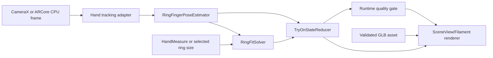

# HandTryOn 7.5 Quality Upgrade Architecture

## Goal

Raise HandTryOn from a technical proof-of-concept to a credible product-grade virtual ring try-on experience.

The target is not to match enterprise platforms such as Perfect Corp, Banuba, Camweara, or mirrAR feature-for-feature. The target is to reach roughly 7.5/10 of that user-perceived quality for a focused single-category ring try-on flow:

- the ring stays attached to the intended finger in live camera use;
- scale is believable and tied to either measured finger size or a defensible visual estimate;
- the ring looks like a 3D object wrapping around the finger, not a flat sticker;
- rendering is stable enough for product detail use;
- failures degrade cleanly instead of showing misleading placement;
- the architecture remains compatible with a future Blue Peach shopping app and backend/Supabase integration.

## Product Scope

### In scope

- Ring product detail try-on flow.
- Live camera try-on for the ring finger first.
- GLB-based 3D ring rendering.
- HandMeasure handoff for measured diameter/finger width.
- Non-ARCore camera-relative 3D fallback.
- ARCore-backed camera stream where available, without depending on world-plane anchors for finger placement.
- Asset validation for product-ready ring models.
- Validation harness using real capture images/videos.
- Runtime diagnostics hidden behind debug/developer mode.

### Out of scope for this upgrade

- Full cart, payment, checkout, or real auth.
- Multi-category jewelry support except where the architecture should not block it.
- Enterprise-level proprietary hand model training.
- Cloud rendering or remote ML inference.
- Full photorealistic material matching for every gemstone and metal.
- Exact certified ring sizing. The goal is shopping confidence, not medical/lab-grade measurement.

## Quality Bar

The upgrade is considered successful when these gates are met:

| Area | Minimum target |
| --- | --- |
| Finger attachment | Ring center is within 0.35x ring width of expected ring-finger zone in at least 85% of validation frames. |
| Scale stability | Ring diameter changes by less than 12% during steady hand pose after smoothing. |
| Rotation stability | Ring axis jitter stays below 8 degrees during steady hand pose. |
| Occlusion | Back half of ring is hidden by the finger in normal dorsal/palmar poses. |
| Runtime | Hand tracking and render update feels live at 12+ effective placement updates/sec on target devices. |
| Failure behavior | Low confidence hides or freezes the ring instead of placing it on background objects. |
| Asset safety | Invalid GLB scale/pivot/material assets fail validation before runtime use. |
| Measurement | HandMeasure handoff changes ring scale in a visible and explainable way. |
| UX | User can enter try-on from product detail, grant camera, see ring, switch size/source, and exit without debug clutter. |

## Architecture Principles

1. Finger-local placement is primary.

   Ring try-on should attach to the hand/finger coordinate system. ARCore world anchors and plane/depth hit tests are useful for camera/light/depth context, but they must not be the source of ring placement.

2. HandMeasure and HandTryOn remain separate capabilities.

   HandMeasure estimates a user measurement. HandTryOn renders and validates a product preview. They share small domain contracts, not internal implementation.

3. The primary renderer is GLB-first.

   PNG overlays can remain only as fallback/debug assets. Product try-on should render normalized 3D models.

4. Quality gates are part of the runtime, not only tests.

   If hand tracking, scale, pose, or asset validation is weak, the runtime should surface a controlled state: search, hold, recover, hide, or fallback.

5. Production UI must not expose developer diagnostics.

   Demo panels are useful now, but product screens should show only user-facing states and controls.

6. Validation data drives tuning.

   Heuristics should be accepted only after replay validation on real captures, not after a single manual test.

## Target Module Layout

Existing modules are mostly directionally correct. The upgrade should refine responsibilities rather than merge them.

```text
:app
  Blue Peach / sample host
  product detail demo
  app-level navigation
  backend/Supabase adapters later

:HandMeasure
  Android hand measurement library
  CameraX + MediaPipe + OpenCV runtime
  ActivityResult API
  debug/replay export

:handmeasure-core
  platform-neutral measurement policies
  capture protocol
  fusion
  ring size mapping

:HandTryOn
  Android try-on runtime
  CameraX/ARCore frame source adapters
  SceneView/Filament renderer adapters
  asset loading and validation
  product-facing Compose components
  runtime telemetry

:handtryon-core
  platform-neutral try-on session state
  finger pose contracts
  scale/depth policies
  quality/tracking state machine
  smoothing
  validation result models
```

## New Internal Packages

### `com.handtryon.tracking`

Owns runtime hand tracking input and conversion.

Responsibilities:

- normalize MediaPipe image landmarks into frame pixel coordinates;
- preserve optional world landmarks if available in the future;
- detect handedness and camera mirroring;
- choose target finger;
- output `TrackedHandFrame`.

Candidate models:

```kotlin
data class TrackedHandFrame(
    val frameWidth: Int,
    val frameHeight: Int,
    val landmarks: List<TrackedLandmark>,
    val handedness: Handedness?,
    val confidence: Float,
    val timestampMs: Long,
    val source: FrameSource,
)

enum class FrameSource {
    CameraX,
    ARCoreCpuImage,
    Replay,
}
```

### `com.handtryon.pose`

Owns ring-finger local coordinate estimation.

Responsibilities:

- derive ring-finger center from landmarks 13, 14, and 15;
- derive tangent, normal, roll, local width, and confidence;
- reject impossible poses;
- expose stable, testable `RingFingerPose`.

Minimum landmarks:

- ring MCP: 13
- ring PIP: 14
- ring DIP: 15
- middle MCP/PIP: 9/10
- little MCP/PIP: 17/18
- wrist/palm reference: 0, 5, 9, 13, 17

Output:

```kotlin
data class RingFingerPose(
    val centerPx: Point2,
    val tangentPx: Vec2,
    val normalPx: Vec2,
    val rollDegrees: Float,
    val yawHintDegrees: Float,
    val fingerWidthPx: Float,
    val confidence: Float,
    val rejectReason: PoseRejectReason? = null,
)
```

### `com.handtryon.fit`

Owns scale, depth, and ring model fit.

Responsibilities:

- combine `RingFingerPose`, `MeasurementSnapshot`, and `GlbAssetSummary`;
- estimate ring outer diameter in pixels;
- estimate camera-relative depth for 3D renderers;
- derive model scale from real GLB bounds;
- clamp scale/depth changes.

Fit priority:

1. Live HandMeasure result with usable confidence.
2. Product-selected size converted to diameter.
3. Visual finger-width estimate.
4. Conservative default size.

Output:

```kotlin
data class RingFitState(
    val ringOuterDiameterMm: Float,
    val modelScale: Float,
    val targetWidthPx: Float,
    val depthMeters: Float,
    val confidence: Float,
    val source: RingFitSource,
)
```

### `com.handtryon.render3d`

Owns renderer-independent 3D render state.

Responsibilities:

- convert `RingFingerPose + RingFitState` into model transform;
- define render passes;
- describe occluder geometry;
- keep Android/SceneView classes out of policy logic.

Output:

```kotlin
data class TryOnRenderState3D(
    val ringTransform: RingTransform3D,
    val fingerOccluder: FingerOccluderState?,
    val quality: TryOnRenderQuality,
)
```

### `com.handtryon.renderer.sceneview`

Owns SceneView/Filament implementation.

Responsibilities:

- GLB model instance loading;
- camera background;
- light setup;
- ring node transform;
- depth-only occluder material;
- screenshot/export later;
- device fallback errors.

This package may depend on Android, Compose, SceneView, ARCore, and Filament.

### `com.handtryon.assets`

Owns product model validation and normalized asset metadata.

Responsibilities:

- parse GLB summary;
- validate scale and units;
- validate pivot/origin;
- validate material count and unsupported extensions;
- create normalized report;
- support per-SKU metadata.

Validation should fail build-time or pre-publish where possible, runtime only as a last line of defense.

### `com.handtryon.validation`

Owns replay evaluation and quality scoring.

Responsibilities:

- run recorded images/videos through hand tracking;
- compare placement against manually annotated expected finger zones;
- output metrics JSON/HTML;
- track regressions across algorithm changes.

## Runtime Pipeline

### Primary live path



### Renderer modes

| Mode | Use case | Placement source | Camera source |
| --- | --- | --- | --- |
| `CameraRelative3D` | Default and non-ARCore fallback | Finger-local pose | CameraX |
| `ARCoreCamera3D` | ARCore available | Finger-local pose | ARCore camera stream |
| `Static3DPreview` | Product page fallback | Product model only | none |
| `Legacy2DOverlay` | Debug/compat only | RingPlacement | CameraX |

Important: `ARCoreCamera3D` must not use world-plane anchors for ring placement. The ring is attached to a moving finger, not a room surface.

## Hand Tracking Upgrade

### Current state

- MediaPipe hand landmarks are already available.
- Try-on placement currently uses landmarks through a lightweight anchor factory.
- Runtime FPS in captured screenshots was around 5-6 placement updates/sec.

### Needed upgrades

- Make tracking output an explicit contract instead of passing raw `HandPoseSnapshot` through UI state.
- Add handedness/mirroring handling.
- Add target finger selection, even if default remains ring finger.
- Add lost-hand recovery state.
- Add confidence penalties for:
  - finger partially outside frame;
  - ring finger crossing another finger;
  - severe blur/motion;
  - hand too small/too large;
  - impossible landmark geometry.

### Acceptance gate

- Stable tracking at normal hand distance for at least 30 seconds without the ring jumping to background or another finger.

## Finger Pose and Fit Upgrade

### Current state

- `RingFingerPoseSolver` uses ring MCP/PIP/DIP and middle/little references.
- Placement still depends heavily on screen-space `RingPlacement`.

### Needed upgrades

- Promote `RingFingerPoseSolver` into core policy with tests.
- Use ring-finger local axes as the canonical coordinate system.
- Estimate cross-finger width from neighboring finger/palm geometry instead of only MCP-PIP length ratio.
- Separate:
  - visual ring outer diameter;
  - measured equivalent inner diameter;
  - model GLB bounds;
  - render scale.
- Add scale source labels so UX can say whether fit came from measured hand, selected size, or visual estimate.

### Acceptance gate

- On replay data, ring remains centered on the ring zone and scales visibly but not wildly when measurement changes.

## Rendering Upgrade

### Current state

- SceneView/ARScene can load and display GLB.
- GLB bounds are known.
- Material/lighting are basic.

### Needed upgrades

- Keep GLB as primary visual path.
- Use consistent camera-relative projection for ARCore and non-ARCore modes.
- Add metal-friendly default lighting:
  - camera/environment light estimate when available;
  - fallback HDR/environment map;
  - tuned exposure and tone mapping.
- Normalize model orientation and pivot:
  - ring hole center near origin;
  - ring plane axis known;
  - real-world units declared.
- Add LOD/compression support later:
  - original GLB for high-end;
  - optimized GLB for mid devices.

### Acceptance gate

- Ring appears as a 3D object with coherent orientation across dorsal and palmar hand poses.

## Occlusion Upgrade

### Phase A: geometric finger occluder

Create a capsule/cylinder mesh aligned with the ring finger segment. Render it as depth-only:

- color write disabled;
- depth write enabled;
- depth test enabled;
- pass order before ring model.

This should make the ring look like it wraps around the finger.

### Phase B: split ring passes

If depth-only occlusion is not stable enough, split the ring model into front/back halves:

1. render back half;
2. render finger occluder;
3. render front half.

This is more deterministic for thin rings.

### Phase C: hand silhouette mask

Add only after Phase A/B are stable. Use a polygonal landmark mask first; add ML segmentation only if needed.

### Acceptance gate

- In normal pose, the rear side of the ring is hidden by the finger and the front side remains visible.

## Asset Pipeline

### Required metadata per ring SKU

```json
{
  "sku": "ring-001",
  "modelAssetPath": "tryon/rings/ring-001.glb",
  "outerDiameterMm": 21.0,
  "innerDiameterMm": 17.3,
  "bandWidthMm": 1.8,
  "pivot": "ring_center",
  "units": "meters",
  "materialProfile": "yellow_gold_polished",
  "normalizedAt": "2026-04-29"
}
```

### Validation checks

- GLB magic/version/length.
- No unsupported required extensions.
- Bounds within expected jewelry ranges.
- Pivot near ring center.
- Real-world scale matches metadata.
- Material names or profiles present.
- File size within mobile budget.

### Build/runtime policy

- Build/prepublish validation should catch invalid assets.
- Runtime should show product fallback if an asset fails.
- The renderer should never silently display a wrongly scaled model.

## Measurement Integration

### Current state

- HandMeasure has a meaningful best-effort measurement pipeline.
- TryOn demo receives only diameter, finger width, and confidence through app-layer handoff.

### Needed upgrades

- Create a small public bridge model:

```kotlin
data class TryOnMeasurementInput(
    val equivalentDiameterMm: Float,
    val fingerWidthMm: Float?,
    val confidence: Float,
    val source: MeasurementInputSource,
)
```

- Keep it separate from full `HandMeasureResult` to preserve module boundaries.
- Store the latest measurement in app/session state.
- Allow user to switch between:
  - measured fit;
  - selected product size;
  - visual estimate.

### Accuracy program

- Collect validation data with:
  - known ring size;
  - reference card visible;
  - multiple devices;
  - multiple lighting conditions;
  - at least dorsal and palmar hand poses.
- Track:
  - equivalent diameter error in mm;
  - ring-size bucket error;
  - confidence calibration.

## Product UX Architecture

### Product detail entry

The final app flow should be:

1. Product detail.
2. Tap "Try on".
3. Camera permission.
4. Live try-on with product ring.
5. Optional size selector or "Use measured hand".
6. Capture/share or return to product.

### UI states

- `PreparingCamera`
- `SearchingHand`
- `PlaceHandInFrame`
- `Tracking`
- `HoldStill`
- `LowConfidence`
- `MeasurementApplied`
- `Fallback3D`
- `UnsupportedDevice`
- `AssetUnavailable`

### Debug UI

Keep diagnostics behind a developer toggle:

- GLB bounds;
- tracking FPS;
- detector latency;
- confidence;
- source mode;
- placement error overlays.

Do not show these in the production product screen.

## Backend and Blue Peach Readiness

This upgrade should not invent backend contracts prematurely. It should prepare the Android app to consume the existing web/backend product model later.

Recommended app-side contracts:

```kotlin
data class ProductTryOnAsset(
    val productId: String,
    val variantId: String?,
    val sku: String,
    val modelAssetUrl: String?,
    val localAssetPath: String?,
    val metadataUrl: String?,
    val materialProfile: String?,
)
```

Future integration points:

- product catalog fetch;
- Supabase storage URL resolution;
- local asset cache;
- product variant/size selector;
- analytics events:
  - try-on opened;
  - hand detected;
  - measurement applied;
  - capture exported;
  - add-to-cart after try-on.

## Validation Harness

### Required folders

```text
validation/
  tryon/
    captures/
      device-name/
        session-id/
          frames/
          annotations.json
          device.json
          expected.json
    reports/
```

### Annotation schema

```json
{
  "frames": [
    {
      "file": "frame_001.jpg",
      "ringFingerZone": {
        "centerX": 542,
        "centerY": 721,
        "widthPx": 64,
        "rotationDeg": -82
      },
      "visibleFinger": true,
      "notes": ["dorsal", "good_light"]
    }
  ]
}
```

### Metrics

- center error in pixels and as ring-width ratio;
- scale error vs annotation;
- rotation error;
- jitter over time;
- confidence calibration;
- hidden/frozen frame count;
- render latency;
- detector latency;
- memory delta.

### Acceptance report

Each renderer or pose change should produce a report:

- pass/fail summary;
- worst frames;
- representative screenshots;
- metric deltas vs previous baseline.

## Testing Strategy

### Unit tests

- finger pose geometry;
- handedness/mirroring;
- scale/depth solving;
- smoothing and quality gates;
- asset validation;
- measurement bridge mapping.

### Instrumented tests

- GLB loading on device;
- SceneView renderer smoke test;
- camera permission flow;
- ARCore availability mapping;
- basic try-on screen lifecycle.

### Replay tests

- run captured frames through tracking/pose/fit;
- compare metrics against thresholds;
- export report artifacts.

### Manual test matrix

- at least 3 Android devices;
- ARCore-supported and non-ARCore device;
- indoor bright, indoor dim, glare;
- dorsal hand, palmar hand, slight fist, fingers spread;
- hand near/far;
- left and right hand.

## Performance Strategy

### Targets

- detector frame input: 10-15 FPS minimum;
- render loop: device refresh rate where possible;
- placement update: 12+ effective updates/sec;
- per-frame detector latency: under 55 ms target on mid device;
- memory stable over 5-minute session.

### Improvements

- avoid YUV-to-JPEG-to-Bitmap conversion in hot paths;
- reuse buffers;
- downscale analysis input while preserving render resolution;
- throttle detector separately from renderer;
- run detector on single controlled executor;
- keep renderer transforms on main/render-safe path only;
- avoid recreating model nodes during tracking.

## Rollout Phases

### Phase 1: Stabilize current renderer

- Make finger-local placement the only live placement source.
- Keep ARCore world anchors disabled for rings.
- Use `createModelInstance` for local GLB assets.
- Hide or freeze ring on low confidence.
- Add device log checks for loader/session crashes.

Exit criteria:

- no GLB null loader error;
- no ring placement on background objects during normal hand view;
- live demo acceptable for internal testing.

### Phase 2: Core pose/fit refactor

- Move finger pose and fit solver into testable core packages.
- Add replay fixtures from real images/videos.
- Add scale source and quality diagnostics.
- Add unit tests for landmark geometry and measurement scaling.

Exit criteria:

- replay report generated from real captures;
- center/scale/rotation metrics tracked.

### Phase 3: Occlusion and visual realism

- Implement depth-only finger capsule.
- Tune ring orientation and scale.
- Add lighting profile/environment fallback.
- Add material profile metadata.

Exit criteria:

- ring visually wraps around finger in normal poses;
- no obvious flat sticker look in validation captures.

### Phase 4: Product flow

- Replace demo UI with product-detail try-on component.
- Add size selector and measurement source switch.
- Move debug panel behind developer mode.
- Prepare `ProductTryOnAsset` contract for backend/Supabase.

Exit criteria:

- user-facing flow can be shown in a product demo without developer text.

### Phase 5: Asset and validation productionization

- Add asset normalization/validation CLI.
- Add multi-SKU local fixture set.
- Add replay regression task.
- Add capture/export support if needed.

Exit criteria:

- new ring model can be added with a repeatable checklist;
- validation prevents obvious scale/pivot regressions.

## Main Risks

1. MediaPipe landmark depth is relative and noisy.

   Mitigation: use 2D geometry plus measurement/visual scale first; use depth as a hint, not absolute truth.

2. ARCore CPU image orientation may differ by device.

   Mitigation: normalize frame orientation in the tracking adapter and validate with replay screenshots.

3. Occluder geometry may not match real finger shape.

   Mitigation: start with conservative capsule; add split ring pass or mask only after measurable failure cases.

4. Product GLB assets may have inconsistent pivots/scales.

   Mitigation: make asset validation mandatory before runtime.

5. Demo code can leak into production.

   Mitigation: create a product-facing component API and keep debug/demo UI separate.

## Recommended Next Implementation Slice

Start with Phase 2 because it creates the foundation for quality:

1. Create core `RingFingerPose` and `RingFitState` contracts.
2. Move/refactor `RingFingerPoseSolver` behind a testable policy.
3. Add a replay validation folder with the two real screenshots as the first manual reference set.
4. Add metrics for center error, ring width, rotation, confidence, and jitter.
5. Wire `ArTryOnScene` and `NonAr3dTryOnScene` to consume the same render state.

This gives the project a measurable path to 7.5/10 instead of continuing with visual tuning by trial and error.
