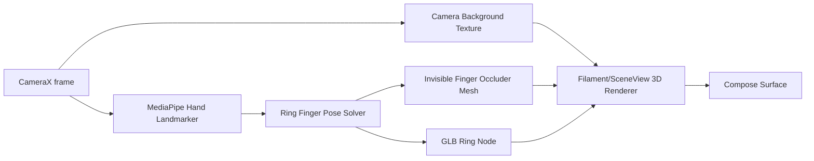

# Non-ARCore 3D Try-On Renderer Research

## Goal

Build a renderer that works on Android devices without ARCore or Google Play Services for AR, including China ROM devices, while still avoiding the current "2D sticker" look.

The renderer must:

- render `ring_AR.glb` as a real 3D model;
- keep the ring aligned to the ring finger;
- make the ring visually wrap around the finger;
- support finger occlusion so parts of the ring disappear behind the finger;
- preserve the existing `HandTryOn` session/quality/smoothing pipeline where possible.

This is not full world-tracking AR. It is a camera-relative 3D try-on renderer for a finger-local object.

## Key Finding

For ring try-on, full ARCore SLAM is not required. The object is not placed on a world plane; it is attached to a moving hand. The required coordinate system is the ring finger, not the room.

The correct non-ARCore architecture is:



## Renderer Stack

Use `SceneView` non-AR, not `ARScene`, for the China ROM path.

Recommended stack:

- Camera: CameraX
- Hand tracking: MediaPipe Hand Landmarker
- 3D renderer: SceneView non-AR or direct Filament
- Model: `ring_AR.glb`
- Occlusion: invisible finger geometry that writes to depth buffer but not color buffer
- Lighting: estimated directional/ambient light from camera frame luminance

Why SceneView non-AR first:

- The project already uses SceneView for AR.
- SceneView exposes Filament-backed 3D model loading without ARCore.
- It lets us keep a Compose-first integration path.
- If depth/material control becomes blocked, move the renderer internals to direct Filament while preserving the same `HandTryOn` API.

## What Makes It Look Real

### 1. Real 3D ring model

The GLB must be the primary render asset. PNG overlay should not participate in the main visual path.

The existing `ring_AR.glb` is suitable as the first target because its parsed bounds are approximately:

- width: `20.40 mm`
- height: `21.19 mm`
- depth: `1.82 mm`

This lets us map model scale from physical measurements instead of visually guessing.

### 2. Finger-local coordinate system

Current 2D anchor uses landmarks 13 and 14:

- `13`: ring MCP
- `14`: ring PIP

For 3D, that is not enough. Use at least:

- `13`: ring MCP
- `14`: ring PIP
- `15`: ring DIP
- `9` or `10`: middle finger reference
- `17` or `18`: little finger reference

Output should be:

```kotlin
data class RingFingerPose3D(
    val centerPx: PointF,
    val tangentPx: Vec2,
    val normalHintPx: Vec2,
    val rollDegrees: Float,
    val fingerWidthPx: Float,
    val fingerRadiusMm: Float?,
    val ringOuterDiameterMm: Float,
    val confidence: Float,
)
```

The tangent is along the finger. The normal hint decides which half of the ring should be in front of the finger and which half should be hidden.

### 3. Camera-relative projection, not world AR

Without ARCore, we do not know true camera pose. But we can still build a stable virtual camera:

- Render camera uses the same aspect ratio as the CameraX preview.
- Choose a fixed virtual FOV, then calibrate from `ringWidthPx` and GLB physical bounds.
- Depth is derived from apparent finger/ring width:

```text
depth ~= focalPx * physicalRingDiameterMm / ringDiameterPx
```

If measured finger diameter exists, use it. Otherwise fallback to GLB bounds and landmark width.

### 4. Occlusion via invisible geometry

This is the core difference from a sticker.

Create a cylinder/capsule mesh approximating the ring finger segment. The mesh is placed through the ring hole and rendered before the ring:

- color write: false
- depth write: true
- depth test: true

Result:

- the finger mesh does not appear visually;
- the ring GLB fails depth test where it is behind the invisible finger;
- the ring appears to pass around the finger.

Filament material properties support disabling color writes while keeping depth writes, which is the required mechanism.

### 5. Optional foreground hand mask

The cylinder occluder solves the ring-around-finger case. It does not solve cases where the whole hand passes in front of the ring.

Later enhancement:

- Generate a soft hand/finger segmentation mask.
- Composite it as a foreground occlusion pass.
- Prefer lightweight geometric mask first; only add ML segmentation if device performance allows.

## Occlusion Strategy

### Phase A: Finger cylinder occluder

Build a capsule mesh using ring finger landmarks:

- start: landmark 13 to 14 interpolation
- end: landmark 14 to 15 interpolation
- radius: `fingerWidthPx / 2` mapped into renderer units
- orientation: align cylinder axis to ring finger tangent

This gives the largest realism improvement with low compute cost.

### Phase B: Split ring front/back if needed

If depth-only occluder is not enough due to model topology or transform issues, preprocess the ring model into:

- front half mesh
- back half mesh

Then render:

1. back half of ring
2. finger occluder depth
3. front half of ring

This is more work but gives deterministic "ring wraps finger" visuals.

### Phase C: Hand silhouette mask

Use this only after Phase A/B are stable. It helps when the finger/hand should cover larger ring areas.

Possible sources:

- generated polygon from hand landmarks;
- MediaPipe segmentation if a suitable model is introduced;
- on-device monocular depth model if performance budget allows.

## Why Not Just Use MediaPipe Z

MediaPipe hand landmarks provide a useful relative depth signal, but not a calibrated metric depth map. It is good for estimating local finger pose and roll. It is not enough by itself for robust per-pixel occlusion.

Use MediaPipe `z` and world landmarks as a pose hint, not as the final depth buffer.

## Proposed Code Architecture

Add a new package:

```text
com.handtryon.nonar3d
```

Candidate classes:

- `NonAr3dTryOnScene`: Compose entry point using CameraX + SceneView non-AR.
- `RingFingerPoseSolver`: converts `HandPoseSnapshot` + `MeasurementSnapshot` into `RingFingerPose3D`.
- `RingModelTransformMapper`: maps `RingFingerPose3D` to model transform.
- `FingerOccluderMeshFactory`: creates/updates invisible capsule/cylinder geometry.
- `DepthOnlyMaterialFactory`: creates the Filament material with `colorWrite=false`, `depthWrite=true`.
- `CameraBackgroundRenderer`: displays CameraX frame as renderer background or synchronized underlay.
- `NonAr3dTryOnController`: owns lifecycle, frame updates, and feature fallback.

Keep `:handtryon-core` Android-free. Put Filament, SceneView, CameraX, Bitmap, and Material APIs only in `:HandTryOn`.

## Placement Algorithm

Input:

- `HandPoseSnapshot`
- optional `MeasurementSnapshot`
- `GlbAssetSummary`
- CameraX frame size

Steps:

1. Detect ring finger axis from landmarks `13 -> 14 -> 15`.
2. Estimate ring center near the base of the finger, currently around the MCP/PIP interpolation.
3. Estimate finger radius from `MeasurementSnapshot.fingerWidthMm` when available.
4. Estimate ring diameter from `MeasurementSnapshot.equivalentDiameterMm`; fallback to GLB bounds.
5. Estimate depth from projected ring diameter and virtual focal length.
6. Build a 3D transform for the ring node.
7. Build/update invisible finger cylinder at the same coordinate frame.
8. Apply smoothing in 3D transform space, not just 2D pixel placement.

## Quality Gates

Render GLB only when:

- hand landmark confidence is above threshold;
- landmarks 13, 14, 15 are visible and stable;
- finger axis length is above minimum;
- projected ring scale jump is within limit;
- roll angle jump is within limit.

Fallback behavior:

- hold last stable 3D transform briefly;
- fade or hide ring on lost tracking;
- do not snap back to default center while camera is live.

## Implementation Phases

### Phase 1: Non-AR 3D scene without occlusion

- Use CameraX preview as background.
- Overlay SceneView non-AR with transparent background.
- Load `ring_AR.glb`.
- Drive model transform from current `TryOnSession.placement`.
- Keep ARCore path untouched.

This replaces PNG with GLB, but still looks partly sticker-like.

Status: implemented as `NonAr3dTryOnScene`.

Current implementation details:

- `TryOnDemoScreen` now uses CameraX background plus `NonAr3dTryOnScene` whenever a GLB model exists and ARCore preview is not active.
- `PreviewView` uses compatible mode so the CameraX view can sit under the transparent SceneView layer.
- Legacy PNG overlay only renders when no 3D model path is available.
- The current transform still reuses `RingPlacement`; this is intentionally Phase 1 and will be replaced by `RingFingerPoseSolver` in Phase 2.

### Phase 2: Finger pose solver

- Add `RingFingerPoseSolver`.
- Use landmarks 13/14/15 plus middle/little finger references.
- Add 3D transform model independent of `RingPlacement`.

This makes the ring orientation and scale more believable.

Status: implemented.

Current implementation details:

- `RingFingerPoseSolver` converts `HandPoseSnapshot`, optional `MeasurementSnapshot`, and optional `GlbAssetSummary` into `RingFingerPose3D`.
- It uses landmarks `13`, `14`, and `15` for the ring-finger axis, plus landmarks `9` and `17` to infer a side/normal hint.
- It estimates center, occluder segment start/end, tangent, roll, finger width, physical radius, ring diameter, and confidence.
- `NonAr3dTryOnScene` now receives the latest hand pose and measurement snapshot and uses the solved roll/confidence when updating the GLB node.

### Phase 3: Depth-only finger occluder

- Add procedural capsule/cylinder mesh.
- Add depth-only material.
- Render occluder before ring.

This is the critical phase for "ring wraps around finger".

Status: geometry render pass implemented; physical-device validation pending.

Current implementation details:

- `FingerOccluderMeshFactory` converts `RingFingerPose3D` into a projected cylinder mesh.
- The mesh output includes vertices, normals, indices, radius, and length in renderer meters.
- `FingerOccluderNodeFactory` converts that mesh into a SceneView `GeometryNode`.
- `NonAr3dTryOnScene` inserts the occluder node before the ring node and gives the ring a higher render priority.
- `DepthOnlyMaterialFactory` currently creates a transparent material instance as the depth-only material candidate.

Validation needed:

- Confirm on device that SceneView's transparent color material still writes depth for this occluder use case.
- If it does not, add a custom compiled Filament `.filamat` with `colorWrite=false` and `depthWrite=true`.

### Phase 4: Visual refinement

- Add contact shadow.
- Add simple camera-frame luminance-based lighting.
- Add metallic material tuning if GLB materials are too flat.
- Add temporal smoothing in 3D.

### Phase 5: Remove PNG path from primary flow

- Keep 2D only as debug/fallback if explicitly enabled.
- Default non-AR devices to 3D renderer.
- Default ARCore devices to ARCore renderer.

## Risks

- CameraX preview and transparent SceneView overlay must be synchronized enough to avoid visible lag.
- MediaPipe landmark depth/roll can be noisy; smoothing is mandatory.
- Invisible occluder geometry will fail if ring/finger coordinate frames are misaligned.
- GLB origin and axis may need normalization. If the model origin is not at the ring center, add a model normalization transform.
- SceneView may not expose all low-level material/depth APIs cleanly; direct Filament may be required for the occluder pass.

## Recommendation

Build the non-ARCore renderer as a separate backend, not as a modification of the ARCore renderer:

```text
TryOnRendererBackend
├── ArCoreTryOnRendererBackend
├── NonAr3dTryOnRendererBackend
└── Legacy2dTryOnRendererBackend
```

The product should select backend by capability:

1. Use `NonAr3dTryOnRendererBackend` as the default Android path.
2. Use `ArCoreTryOnRendererBackend` only when ARCore is available and validated.
3. Keep `Legacy2dTryOnRendererBackend` only during migration and QA.

This gives broad ROM compatibility without accepting sticker-quality output.
